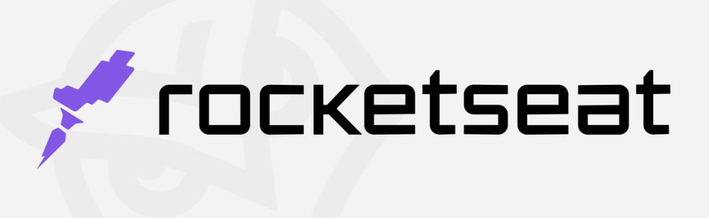

# 21 dias de codigo

#21diasdecodigo é um desafio proposto pela Rocketseat.

A seguir as regras do desafio:
- Todos os dias, codar por pelo menos 1h;
- Compartilhar todos os dias o progresso nas redes sociais e marcar a Rocketseat com a hashtag #21diasdecodigo;
- Gerar networking com as pessoas que também estão participando do desafio.

## Desafios
 - ✅ Dia 01: Criar um repositório para listar os projetos que serão desenvolvidos durante os 21 dias de código.

 - ✅ Dia 02: Fazer um Hello World customizado com fontes, cores e imagens.

 - ✅ Dia 03: Criar um botão animado.

 - ✅ Dia 04: O desafio era criar uma calculadora porém como desenvolvi uma recentemente resolvi fazer um jogo simples.

 - ✅ Dia 05: Desenvolver uma página customizada que exiba o erro 404.

 - ✅ Dia 06: Criar um card com o efeito glassmorphism.
     
 - ✅ Dia 07: Criar um contador.

 - ✅ Dia 08: Desenvolver um toggle que altere o tema para claro e escuro.

 - ✅ Dia 09: Criar uma animação de loading.
 
 - ✅ Dia 10: Utilizar a lib Particles.js do JavaScript

 - ✅ Dia 11: Criar o layout de um formulário de login.

 - ✅ Dia 12: Desenvolver uma galeria de imagens.

 - ✅ Dia 13: Desenvolver um menu responsivo.

 - ✅ Dia 14: Criar um formulário de quizzes.

 - ✅ Dia 15: Desenvolver um site que exiba uma vitrine de produtos de um e-commerce fictício (com nome dos produtos preços e imagens). 
 
 - ❌ Dia 16: Desenvolver um site utilizando alguma API pública.

 - ❌ Dia 17: Desenvolver um site que capture os eventos do teclado e exiba na ela o evento e a tecla pressionada.

 - ❌ Dia 18: Desenvolver um gerador de senhas aleatórias.

 - ❌ Dia 19: Desenvolver um site que gere imagens aleatórias utilizando a API do Unsplash.

 - ❌ Dia 20: Desenvolver um site de emoji picker. Ao selecionar o emoji, é copiado para a área de transferência.

 - ❌ Dia 21: Desenvolver uma página para ser portfólio.